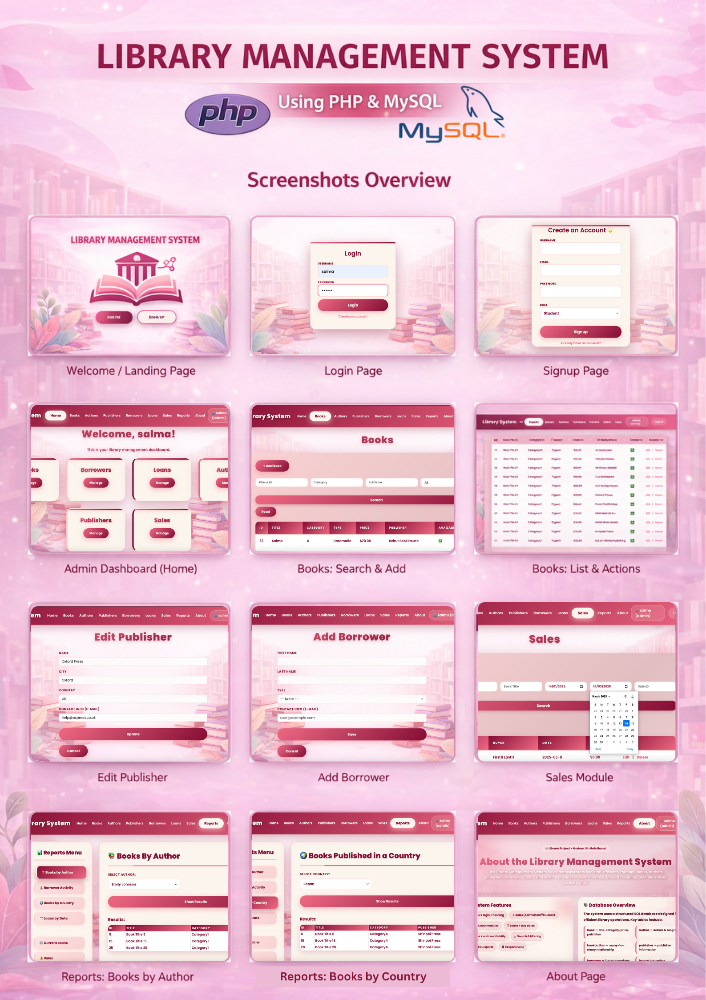

# 📚 Library Management System



A comprehensive web-based Library Management System built with PHP and MySQL, featuring role-based access control, CRUD operations, and advanced reporting capabilities.

🌐 **Live Demo:** [https://salma.page.gd/](https://salma.page.gd/)

---

## 📋 Table of Contents

- [Features](#features)
- [Technologies Used](#technologies-used)
- [System Architecture](#system-architecture)
- [User Roles](#user-roles)
- [Database Schema](#database-schema)
- [Installation](#installation)
- [Usage](#usage)
- [Reports](#reports)
- [Developer](#developer)
- [License](#license)

---

## ✨ Features

### 🔐 Authentication & Authorization
- **Secure Login & Signup** with password hashing
- **Role-based Access Control** (Admin, Staff, Student)
- **Session Management** for secure user sessions

### 📖 Core Functionality
- **View** all database tables (Books, Authors, Publishers, Borrowers, Loans, Sales)
- **Insert** new records with validation
- **Update** existing data with role-based permissions
- **Delete** records with confirmation dialogs
- **Search & Filter** across all tables

### 📊 Advanced Reports (10+ SQL-based queries)
1. Total value of all books
2. Books by selected author
3. Borrower activity (loans and purchases)
4. Current loans and due dates
5. Books by country
6. Borrowers with no activity
7. Books with multiple authors
8. Sales records and prices
9. Available books
10. Loan history by date range
11. Books per category
12. And more!

### 🎨 User Interface
- Clean, modern design with gradient themes
- Responsive layout for mobile and desktop
- Intuitive navigation
- Beautiful data tables with hover effects

---

## 🛠️ Technologies Used

### Frontend
- **HTML5** - Structure
- **CSS3** - Styling with gradients and animations
- **Bootstrap 5** - Responsive framework
- **JavaScript** - Client-side validation and interactivity

### Backend
- **PHP 8.x** - Server-side logic
- **MySQL** - Database management
- **PDO/MySQLi** - Database connectivity

### Deployment
- **InfinityFree** - Free web hosting service

---

## 🏗️ System Architecture

```
┌─────────────────────────────────────────┐
│         Presentation Layer              │
│   (HTML, CSS, JavaScript, Bootstrap)    │
└─────────────────┬───────────────────────┘
                  │
┌─────────────────▼───────────────────────┐
│         Application Layer               │
│              (PHP)                       │
│  ┌──────────────────────────────────┐  │
│  │ Authentication & Authorization   │  │
│  │ CRUD Operations                  │  │
│  │ Report Generation                │  │
│  │ Input Validation                 │  │
│  └──────────────────────────────────┘  │
└─────────────────┬───────────────────────┘
                  │
┌─────────────────▼───────────────────────┐
│          Data Layer                     │
│           (MySQL)                        │
│  ┌──────────────────────────────────┐  │
│  │ Users, Books, Authors            │  │
│  │ Publishers, Borrowers            │  │
│  │ Loans, Sales, Types              │  │
│  └──────────────────────────────────┘  │
└─────────────────────────────────────────┘
```

---

## 👥 User Roles

| Role | Permissions |
|------|------------|
| **Admin** | ✅ View, Insert, Update, Delete all records<br>✅ Access all reports<br>✅ Manage users |
| **Staff** | ✅ View all records<br>✅ Access reports<br>❌ Insert/Update/Delete limited |
| **Student** | ✅ View records<br>✅ Search and filter<br>❌ No Insert/Update/Delete |

---

## 🗄️ Database Schema

### Main Tables

#### 1. **Users**
- `user_id` (PK)
- `username` (unique)
- `email` (unique)
- `password` (hashed)
- `role` (admin/staff/student)

#### 2. **Books**
- `book_id` (PK)
- `title`
- `publisher_id` (FK)
- `category`
- `book_type`
- `original_price`
- `available` (boolean)

#### 3. **Authors**
- `author_id` (PK)
- `first_name`
- `last_name`
- `country`
- `bio`

#### 4. **Publishers**
- `publisher_id` (PK)
- `name`
- `city`
- `country`
- `contact_info`

#### 5. **Borrowers**
- `borrower_id` (PK)
- `first_name`
- `last_name`
- `type_id` (FK)
- `contact_info`

#### 6. **Loans**
- `loan_id` (PK)
- `borrower_id` (FK)
- `book_id` (FK)
- `period_id` (FK)
- `loan_date`
- `due_date`
- `return_date`

#### 7. **Sales**
- `sale_id` (PK)
- `book_id` (FK)
- `borrower_id` (FK)
- `sale_date`
- `sale_price`

---

## 🚀 Installation

### Prerequisites
- PHP 7.4 or higher
- MySQL 5.7 or higher
- Web server (Apache/Nginx)

### Local Setup

1. **Clone the repository**
```bash
git clone https://github.com/salma-abuodeh/Library-Management-System-PHP-MySQL.git
cd Library-Management-System-PHP-MySQL
```

2. **Import the database**
```bash
mysql -u root -p < libr.sql
```

3. **Configure database connection**
Edit `db.php`:
```php
$host = "localhost";
$user = "root";
$pass = "";
$db = "libr";
```

4. **Start your local server**
```bash
# Using PHP built-in server
php -S localhost:8000

# Or configure Apache/Nginx to point to the project directory
```

5. **Access the application**
```
http://localhost:8000
```

### Default Login Credentials

| Username | Password | Role |
|----------|----------|------|
| salma | 123456 | Admin |

---

## 📱 Usage

### 1. **Landing Page**
- Welcome screen with Sign In and Sign Up options
- Beautiful gradient design with animations

### 2. **Login**
- Enter username and password
- Client-side validation
- Secure password verification

### 3. **Dashboard**
- Role-based navigation cards
- Quick access to:
  - Books Management
  - Authors Management
  - Publishers Management
  - Borrowers Management
  - Loans Management
  - Sales Management

### 4. **Data Management**
- **View**: Browse all records in clean tables
- **Search**: Filter by multiple criteria
- **Add**: Insert new records (Admin only)
- **Edit**: Update existing data (Admin only)
- **Delete**: Remove records with confirmation (Admin only)

### 5. **Reports**
- Select from 10+ pre-built reports
- Filter by author, country, date range, etc.
- Export-ready table format

---

## 📊 Reports

### Available Reports

1. **📚 Books by Author** - Filter books by selected author
2. **👤 Borrower Activity** - View loans and purchases per borrower
3. **🌍 Books by Country** - Books published in a specific country
4. **📅 Loans by Date Range** - Loans within selected dates
5. **🔍 Current Loans** - All active loans with due dates
6. **💰 Sales Report** - All book sales with prices
7. **✅ Available Books** - Books currently available for borrowing
8. **📈 Books per Category** - Distribution of books by category
9. **🚫 Inactive Borrowers** - Borrowers with no activity
10. **📖 Multi-Author Books** - Books written by multiple authors
11. **💵 Total Book Value** - Sum of all book prices in library

---

## 👨‍💻 Developer

**Developed by:** Salma Abu Odeh

**Contact:**
- 🌐 Website: [https://salma.page.gd/](https://salma.page.gd/)
- 📧 Email: salmamahmoudao@gmail.com
- 💻 GitHub: [salma-abuodeh](https://github.com/salma-abuodeh)

---

## 📄 License

This project was developed as part of a Web Technologies course assignment.

**Educational Purpose Only** - This project is intended for learning and demonstration purposes.

---

## 🙏 Acknowledgments

- **InfinityFree** for providing free hosting services
- **Bootstrap** for the responsive framework
- **PHP & MySQL** communities for excellent documentation
- Course instructor for project guidance

---

## 🔧 Future Enhancements

- [ ] Email notifications for due dates
- [ ] Barcode scanning for books
- [ ] Fine calculation for late returns
- [ ] Book reservation system
- [ ] Advanced analytics dashboard
- [ ] PDF export for reports
- [ ] Multi-language support

---

## 📞 Support

For issues, questions, or suggestions:
1. Visit the [About Page](https://salma.page.gd/about.php) on the website
2. Check existing issues in the repository
3. Contact through the website contact form or email

---

**Made with ❤️ by Salma Abu Odeh**

⭐ If you found this project helpful, please give it a star!

---

**Last Updated:** January 2026